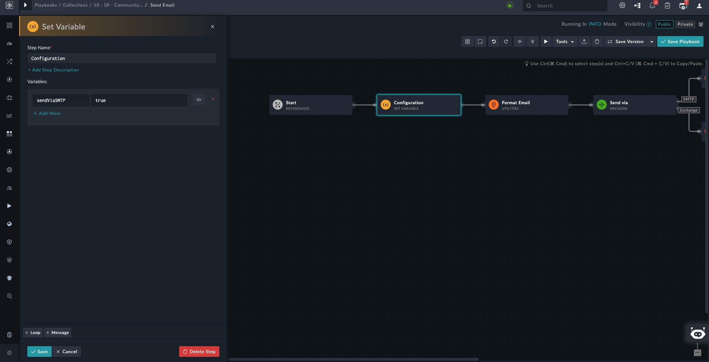

| [Home](../README.md) |
|----------------------|
# Installation

1. To install a solution pack, click **Content Hub** > **Discover**.   
2. From the list of solution pack that appears, search for and select **Submit Your Content**.    
3. Click the **Submit Your Content** solution pack card.   
4. Click the **Install** button on the bottom to begin the installation.

# Configuration

By default SMTP is selected as a mode to send email. Can be changed through playbook, send email.

| [Usage](./usage.md) | [Contents](./contents.md) |
|---------------------|---------------------------|